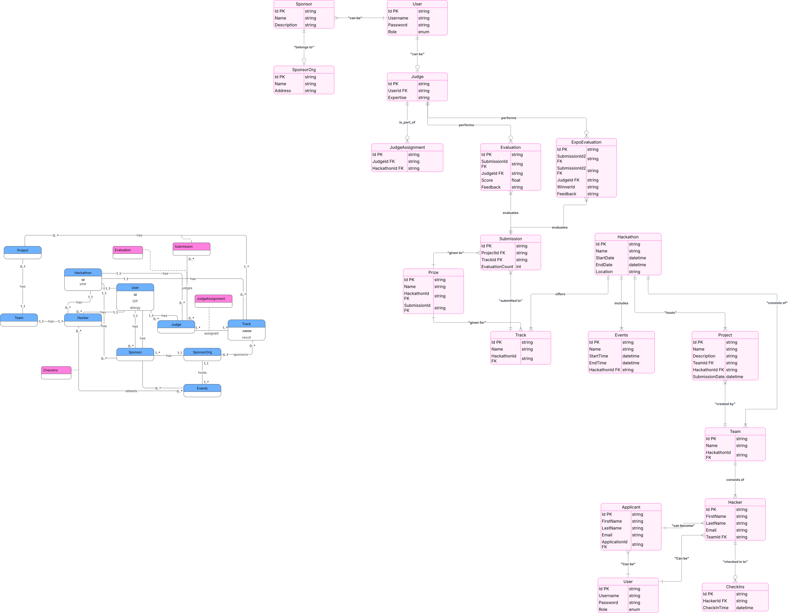

# RFC 0008: Database Model

- **Status:** Accepted
- **Author(s):** @kritdass
- **Created:** 2026-03-28
- **Updated:** 2026-03-28

## Overview

This RFC establishes the database model that the Terrier application will use.

## Motivation

Terrier is a very complex application, requiring several interconnected tables with related data to work. Having a strictly defined, scalable schema and a clear workflow for generating database entities is critical for maintaining data integrity and accelerating backend development.

## Goals

- Define the core entities, relationships, and schema for the Terrier application
- Establish a single source of truth for the database architecture
- Automate the generation of Rust database entities to minimize boilerplate
- Ensure type-safe, asynchronous database interactions using SeaORM

## Non-Goals

- Deciding on the physical database hosting provider or infrastructure
- Defining the exact business logic or API routes that will interact with this data
- Writing raw SQL queries for standard CRUD operations

## Detailed Design

The Terrier database model is visually mapped out and maintained in a central diagram. The development workflow will rely on a code-first migration approach paired with automated entity generation to ensure our Rust backend stays perfectly in sync with the database schema.

### Schema Source of Truth

The visual representation and relationships of all interconnected tables are stored and maintained at `./media/terrier-database-model.svg`. This diagram serves as the high-level reference for all developers when planning feature integrations.

### ORM and Tooling Workflow

We are utilizing **Rust** as our backend language alongside **SeaORM**, an async, dynamic ORM. The workflow for interacting with and updating the database model is as follows:

1. **Migrations:** Schema changes (creating tables, altering columns, defining foreign keys) will be written using SeaORM's migration system. This ensures a version-controlled, reproducible database state across all environments.
1. **Entity Generation:** Instead of manually writing Rust structs for our database tables, we will use the `sea-orm-cli`. After running migrations, developers will run the CLI tool to automatically introspect the database and generate the corresponding Rust entities, schemas, and relational bindings.
1. **Type Safety:** By relying on the CLI, we guarantee that our Rust backend types strictly match our database columns, preventing runtime serialization errors.
